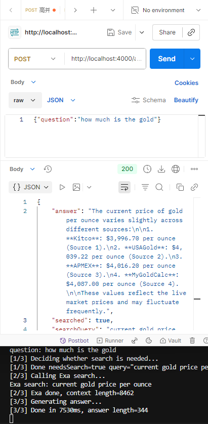
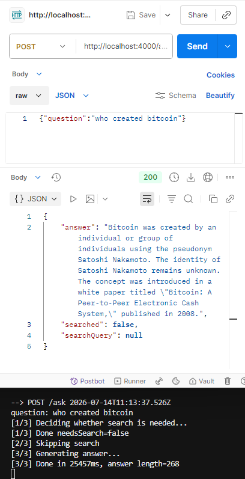

# decide-search-ask

Conditional web search for LLMs: a small model decides SEARCH / NO_SEARCH, then [Exa](https://exa.ai) + a larger model answers.

Inspired by [Zoom Chat Neural Search Assistant Sample](https://github.com/zoom/Zoom-Chat-Neural-Search-Assistant-Sample), rewritten as a standalone HTTP API (no Zoom / Cerebras dependency).

## Demo

**With search** — rewrites a vague question, calls Exa, then answers (API + server logs):



**Without search** — skips Exa when the model already knows the answer:



## How it works

```
POST /ask  { "question": "..." }
        │
        ▼
┌───────────────────┐
│  Decision model   │  SEARCH + query  or  NO_SEARCH
└─────────┬─────────┘
          │
    needs search?
     /         \
   yes          no
    │            │
    ▼            │
┌───────┐        │
│  Exa  │        │
└───┬───┘        │
    └────┬───────┘
         ▼
┌───────────────────┐
│   Answer model    │
└─────────┬─────────┘
          ▼
   { answer, searched, searchQuery }
```

## Setup

```bash
cp .env.example .env
# Fill in OPENAI_API_KEY, EXA_API_KEY, etc.
npm install
npm start
```

Server listens on `http://localhost:4000` (or `PORT` from `.env`).

## API

### `POST /ask`

```json
{ "question": "What is the current gold price per ounce?" }
```

```json
{
  "answer": "...",
  "searched": true,
  "searchQuery": "current gold price per ounce"
}
```

| Field         | Type    | Description                                      |
|---------------|---------|--------------------------------------------------|
| `answer`      | string  | Final answer from the model                      |
| `searched`    | boolean | Whether Exa search was performed                 |
| `searchQuery` | string \| null | Optimized query used for search (if any)  |

### Other endpoints

- `GET /` — service info
- `GET /health` — health check

## Environment

See [`.env.example`](.env.example):

| Variable         | Description                                              |
|------------------|----------------------------------------------------------|
| `OPENAI_API_KEY` | OpenAI-compatible API key                                |
| `OPENAI_BASE_URL`| Base URL (OpenAI / proxy / self-hosted gateway)          |
| `DECISION_MODEL` | Small model that decides SEARCH vs NO_SEARCH             |
| `ANSWER_MODEL`   | Larger model that answers / summarizes                   |
| `EXA_API_KEY`    | Exa API key (required when search is needed)             |
| `PORT`           | HTTP port (default `4000`)                               |

## License

MIT
